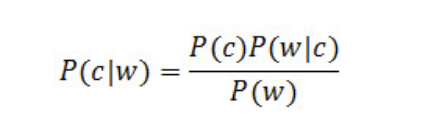

  
```{r setup, include=FALSE}
knitr::opts_chunk$set(echo = TRUE)
```
# Assignment 11.2 Instructions

Spell checking and correction is a simple, yet powerful application of Bayes theorem. Given an input word, and proposed correction, we can calculate the probability of the correction being correct using Bayes theorem.



In this problem, you will implement a spelling corrector based on Peter Norvig’s article, How to Write a Spelling Corrector and using the following word frequency data.

a. Load the word frequency data into a dataset. The initial dataset should have two variables, the word and the number of occurrences of that word. Create a third variable for word probability that provides the overall probability of that word occurring in the dataset.

b. Create a function that when given an input word, returns a list of candidates that are within two edits from the input word. The returned candidates should be within the known word list. Use Norvig’s Python implementation, How to Write a Spelling Corrector, for reference. Demonstrate this function on colum, heirarchy, knowlege, and adres.

c. Create a function that provides the top three suggestions for each word. Demonstrate this function on colum, heirarchy, knowlege and adres.

d. List three ways you could improve this spelling corrector.

## Load the word frequency data into a dataset. The initial dataset should have two variables, the word and the number of occurrences of that word. Create a third variable for word probability that provides the overall probability of that word occurring in the dataset.
```{r echo=TRUE}
library(readr)
library(dplyr)

# read the data file
wordsFile <- read_delim("en_full.txt", delim=" ", col_names = FALSE)
# set the column names
names(wordsFile)[1] <- "word"
names(wordsFile)[2] <- "count"
glimpse(wordsFile)

# add column for word probability
pctWord <- wordsFile$count / sum(wordsFile$count) #this gives the % occurence

wordsFile <- cbind(wordsFile, pctWord)
glimpse(wordsFile)
```

## Create a function that when given an input word, returns a list of candidates that are within two edits from the input word. The returned candidates should be within the known word list. Use Norvig’s Python implementation, How to Write a Spelling Corrector, for reference. Demonstrate this function on colum, heirarchy, knowlege, and adres.

### See my notes below regarding the word list and target words to check the assignment. Additionally, I have left my troubleshooting code in the function, commented out, to understand for myself what I did to figure out the problems with the word file.
```{r echo=TRUE}
#create a vector of the ordered words
wordList <- wordsFile$word

rightWord <- function(inputWord) {
  # Calculate the edit distance between the word and all other words in the word file list.
  editDist <- adist(inputWord, wordList)
  #glimpse(editDist)
  
  # Calculate the minimum edit distance to find a word that exists in the word list
  # with a limit of two edits.
  minEditDist <- min(editDist, 2)
  #glimpse(minEditDist)
  #print("a")
  
  # Generate a vector with all words with this minimum edit distance.
  # Since wordList is ordered from most common to least common, the resulting
  # vector will have the most common / probable match first.
  proposalsByProb <- c(wordList[editDist <= min(editDist, 2)])
  #print(proposalsByProb)
  
  # In case proposalsByProb is empty, append the input word
  proposalsByProb <- c(proposalsByProb, inputWord)
  
  #print("2")
  #print(proposalsByProb)
  
  #return the first / most probable word in the vector.
  c(proposalsByProb[1], proposalsByProb[2], proposalsByProb[3])
}
theWords <- rightWord("colum")
theWords
theWords <- rightWord("heirarchy")
theWords
theWords <- rightWord("knowlege")
theWords
theWords <- rightWord("adres")
theWords
theWords <- rightWord("papr")
theWords
theWords <- rightWord("laptoop")
theWords
```
### There is a disconnect between the word file and the words in the assignment designed to check the spell check function. While all 4 of the words appear to the lay person to be misspelled, all of them actually are in the file, so the program does not detect them as incorrect. As a result, I searched the file and found that "papr" and "laptoop" don't exist, so I used them to verify that my code was functioning correctly.

Here are the 4 "misspelled" words, and their count in the file:

1. heirarchy 2
2. colum 164
3. knowlege 5
4. adres 11

### List three ways you could improve this spelling corrector.

1. At the moment, it only accounts for words without capital letters. One way to improve would be to allow, and check, for words that start with a capital letter.

2. Another way to improve the spell checker would be to include other words that might typically be used in the same context as the correction word, and have the spell checker look for other words around the target word. This would require the program to take in a sentence or phrase, and parse the words in it, versus the current method of taking in a single word. The spell checker would display the recommended words based on the context and frequency, not just the most used words.

3. A third way to improve would be to include contraction words in the "dictionary" and detect for them.